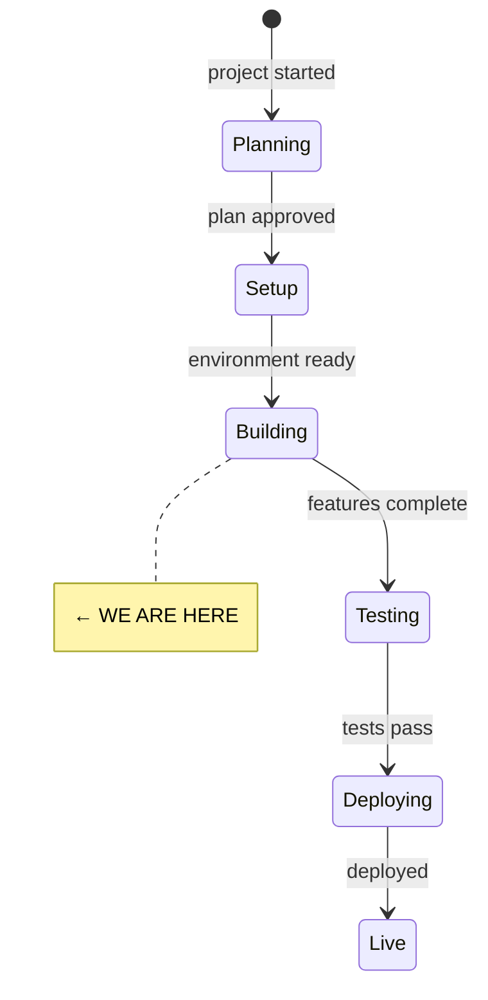
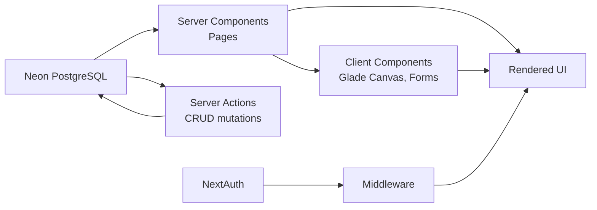

# State

> Last updated: 2026-02-15

## System State Diagram

## Component Status

### Phase 0 — Project Setup & Foundation

| Component | Status | Notes |
|-----------|--------|-------|
| Next.js 15 + App Router + TypeScript + Tailwind v4 | ✅ Done | Turbopack dev server configured |
| ESLint + project structure | ✅ Done | `src/app`, `src/lib`, `src/components`, `src/db` |
| UI component foundation | ✅ Done | Custom design system, lucide-react, clsx, Fraunces + DM Sans |
| Design system (globals.css) | ✅ Done | Forest palette (oklch), fluid type scale, status colours |
| NextAuth (Auth.js v5) | ✅ Done | Credentials + magic link + Google + Microsoft OAuth. Edge-compatible middleware. |
| Neon PostgreSQL + Drizzle ORM | ✅ Done | Connected, schema pushed, migrations generated |
| Database schema (15 tables) | ✅ Done | Auth tables + spaces, decisions, meetings, actions, tags, links |
| Sign-in / sign-up pages | ✅ Done | Styled in Glade design system, all auth methods |
| Route protection (middleware) | ✅ Done | Public: `/`, `/sign-in`, `/sign-up`. All app routes require auth. |
| Update CLAUDE.md | ✅ Done | Full project conventions documented |
| Vercel deployment | ⏳ Not started | |
| Resend email | ⚠️ Partial | Provider configured in NextAuth, needs API key |

### UI Prototype (built with mock data)

| Component | Status | Notes |
|-----------|--------|-------|
| Landing page (`/`) | ✅ Done | Hero, features, decision lifecycle, methods, CTA, footer |
| App shell + sidebar | ✅ Done | Collapsible sidebar, space selector (hardcoded), nav with active states |
| Dashboard (`/dashboard`) | ✅ Done | Stats strip, recent decisions, open actions, reviews, meetings |
| Decision log (`/decisions`) | ✅ Done | Timeline view grouped by month, search bar, status filters |
| Decision detail (`/decisions/[number]`) | ✅ Done | Full detail: context, rationale, outcome, actions, lifecycle, linked decisions |
| Actions page (`/actions`) | ✅ Done | Sorted by urgency, status badges, linked decisions |
| Meetings page (`/meetings`) | ✅ Done | Date blocks, attendee/decision counts, type badges |
| The Glade (`/glade`) | ✅ Done | SVG canvas: decisions as tree forms, clustered, sized, growth rings, tooltips |
| Mock data | ✅ Done | 7 decisions, 5 actions, 4 meetings (Riverside Trust) |

### Phase 1 — Core Decision Log (MVP)

| Component | Status | Notes |
|-----------|--------|-------|
| Space management (create, switch, cookie) | ✅ Done | Server actions, new-space page, space switcher in sidebar |
| Seed script | ✅ Done | Riverside Trust data: 8 users, 7 decisions, 5 actions, 4 meetings, 9 tags |
| Replace mock data with DB queries | ✅ Done | All 6 app pages wired to Drizzle queries via `src/lib/queries.ts` |
| Decision CRUD (create, edit) | ✅ Done | `/decisions/new`, `/decisions/[number]/edit`, server actions |
| Meeting CRUD (create) | ✅ Done | `/meetings/new`, server actions |
| Action status toggle | ✅ Done | Click-to-cycle status on actions page |
| Decision search + status filters | ✅ Done | Client-side search + filter on `/decisions` |
| Mock data removed | ✅ Done | `mock-data.ts` deleted, all pages use DB |
| Meeting detail page | ✅ Done | `/meetings/[id]` with notes, agenda, attendees, linked decisions |
| Decision linking UI | ✅ Done | Add/remove links (supersedes, relates_to, amends) from detail page |
| Decision status advance | ✅ Done | "Mark as [next]" button on detail page |
| Link decisions to meetings | ✅ Done | Link/unlink meetings from decision detail page |
| Dashboard time-aware greeting | ✅ Done | Morning/afternoon/evening based on server time |
| Space settings page | ✅ Done | `/settings` with name/description edit, danger zone delete |
| Member management + invite | ✅ Done | `/members` with roles, invite by email, remove |
| Meeting agenda items | ✅ Done | Ordered agenda with type (for_decision/discussion/information) |
| Loading skeleton | ✅ Done | Generic skeleton loading component |
| Responsive layout | ✅ Done | Mobile hamburger nav, responsive padding, single-column on mobile |

## Data Flow

Next milestone: Vercel deployment, Resend email, advanced decision filters. Phase 2 (Documents & Proposals) ready to begin.

## Dependencies

| Dependency | Status | Notes |
|------------|--------|-------|
| NextAuth (Auth.js v5) | ✅ Working | JWT sessions, Drizzle adapter, credentials + OAuth |
| Neon (PostgreSQL) | ✅ Connected | Schema pushed (15 tables), pooler endpoint |
| Drizzle ORM | ✅ Installed | Schema, relations, migrations configured |
| Vercel (hosting) | Not set up | |
| Resend (email) | Partial | Provider configured, needs `AUTH_RESEND_KEY` |
| Stripe (billing) | Not set up | Phase 5 |
| Anthropic API (AI) | Not set up | Phase 3 |

<!--
Keep this file as the single source of truth for "where are we?"
The /status command reads this file.
-->
