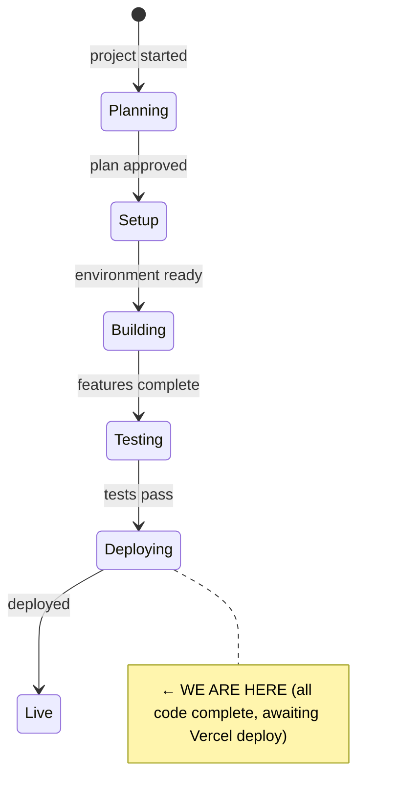
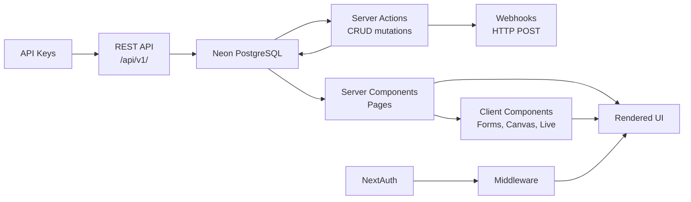

# State

> Last updated: 2026-02-27

## System State Diagram

## Summary

All 5 phases of application code are **feature-complete**. WCAG 2.1 AA accessibility pass is **complete** (14 commits). The remaining code work is integration tasks (Google Calendar, Microsoft Outlook, Notion import — plan at `docs/plans/2026-02-27-accessibility-and-integrations.md`, Tasks 11–17). External service configuration (Vercel deploy, Resend email, Sentry, Stripe production setup) still pending. See PLAN.md [Manual Deployment Steps](#manual-deployment-steps) for step-by-step instructions.

**Database:** 26 tables (24 original + `api_keys` + `webhooks`). All columns applied to Neon. Drizzle schema.ts is source of truth; generated migrations may lag behind.

## Component Status

### Phase 0 — Project Setup & Foundation

| Component | Status | Notes |
|-----------|--------|-------|
| Next.js 15 + App Router + TypeScript + Tailwind v4 | ✅ Done | Turbopack dev server configured |
| ESLint + project structure | ✅ Done | `src/app`, `src/lib`, `src/components`, `src/db` |
| UI component foundation | ✅ Done | Custom design system, lucide-react, clsx, Fraunces + DM Sans |
| Design system (globals.css) | ✅ Done | Forest palette (oklch), fluid type scale, status colours |
| NextAuth (Auth.js v5) | ✅ Done | Credentials + magic link + Google + Microsoft OAuth. Edge-compatible middleware. |
| Neon PostgreSQL + Drizzle ORM | ✅ Done | Connected, schema pushed, migrations generated |
| Database schema (26 tables) | ✅ Done | Auth + spaces, decisions, meetings, actions, tags, links, documents, proposals, topics, insights, subscriptions, api_keys, webhooks |
| Sign-in / sign-up pages | ✅ Done | Styled in Glade design system, all auth methods |
| Route protection (middleware) | ✅ Done | Public: `/`, `/sign-in`, `/sign-up`, `/api/v1`, `/shared`, `/public`, `/embed`. All app routes require auth. |
| Update CLAUDE.md | ✅ Done | Full project conventions documented |
| Vercel deployment | ⏳ Pending | See PLAN.md Manual Deployment Steps |
| Resend email | ⏳ Pending | Provider configured in NextAuth, needs `AUTH_RESEND_KEY` |

### Phase 1 — Core Decision Log (MVP)

| Component | Status | Notes |
|-----------|--------|-------|
| Space management (create, switch, cookie) | ✅ Done | Server actions, new-space page, space switcher in sidebar |
| Seed script | ✅ Done | Full demo: 9 users, 7 decisions, 9 actions, 4 meetings, 9 tags, 3 documents, 4 proposals, 4 topics, 3 AI insights. Idempotent with `--force` flag. |
| Replace mock data with DB queries | ✅ Done | All app pages wired to Drizzle queries via `src/lib/queries.ts` |
| Decision CRUD (create, edit) | ✅ Done | `/decisions/new`, `/decisions/[number]/edit`, server actions |
| Meeting CRUD (create, edit) | ✅ Done | `/meetings/new`, `/meetings/[id]/edit`, server actions |
| Action status toggle | ✅ Done | Click-to-cycle status on actions page |
| Decision search + advanced filters | ✅ Done | Search, status, method, tags, participant, date range filters |
| Meeting detail page | ✅ Done | `/meetings/[id]` with notes, agenda, attendees, linked decisions |
| Decision linking UI | ✅ Done | Add/remove links (supersedes, relates_to, amends) from detail page |
| Decision status advance | ✅ Done | "Mark as [next]" button on detail page |
| Link decisions to meetings | ✅ Done | Link/unlink meetings from decision detail page |
| Dashboard | ✅ Done | Stats strip, governance health indicators, recent decisions, open actions, reviews, meetings, AI insights |
| Space settings page | ✅ Done | Name/description, AI toggle, public visibility, vote threshold, walkthrough restart, clear data, danger zone delete |
| Member management + invite | ✅ Done | `/members` with roles, invite by email, remove |
| Responsive layout | ✅ Done | Mobile hamburger nav, responsive padding, single-column on mobile |
| Breadcrumb navigation | ✅ Done | All detail/sub-pages have breadcrumb trails |

### Phase 2 — Governance Documents & Proposals

| Component | Status | Notes |
|-----------|--------|-------|
| Tiptap editor component | ✅ Done | Reusable with toolbar, read-only mode, `immediatelyRender: false` for SSR |
| Document CRUD + versioning | ✅ Done | List, create, edit, detail, publish/unpublish, version history, diffs, historical view |
| Decision trail on sections | ✅ Done | Heading → decision mapping with popover + manager |
| Proposal CRUD + lifecycle | ✅ Done | List, create, edit, detail, status lifecycle, threaded discussion, references |
| Topic CRUD | ✅ Done | List, create, detail, promote to proposal, pull into agendas |
| Auto-save drafts | ✅ Done | Debounced 1.5s auto-save with status indicator |

### Phase 3 — AI Layer

| Component | Status | Notes |
|-----------|--------|-------|
| Anthropic SDK integration | ✅ Done | `@anthropic-ai/sdk`, singleton client, 8 prompt templates |
| Pattern analysis | ✅ Done | Manual trigger on dashboard, generates insights |
| Decision review prompter | ✅ Done | Context-aware reflection questions on review |
| Document intelligence | ✅ Done | Impact analysis, stale doc checker, draft updates |
| Insights panel | ✅ Done | Dismissable insights on dashboard with decision links |
| Monthly digest + member briefing | ✅ Done | On-screen preview (email delivery deferred until Resend) |

### Phase 4 — Meeting Mode

| Component | Status | Notes |
|-----------|--------|-------|
| Meeting setup + agenda builder | ✅ Done | From proposals/topics, time estimates, decision methods |
| Real-time polling | ✅ Done | HTTP 2s polling, version-based optimistic locking |
| Facilitator view | ✅ Done | Agenda sidebar, timer, decision controls, action recording |
| Participant view | ✅ Done | Speaker stack, hand-raise, reactions, votes, objections |
| Decision flows | ✅ Done | Consent (6-stage), vote, advice process, lazy consensus, delegation |
| Configurable vote threshold | ✅ Done | Space setting, threaded to VoteFlow component |
| Share/observer | ✅ Done | Token-based public URLs, QR code, read-only observer |
| Post-meeting | ✅ Done | Structured summary, AI summary, PDF export via print page |

### Phase 5 — SaaS Infrastructure

| Component | Status | Notes |
|-----------|--------|-------|
| Stripe billing | ✅ Done | Schema, checkout, webhooks, portal, feature gates, plan display |
| Transparency layer | ✅ Done | Public decision log + documents, per-item visibility, embeddable widget |
| Onboarding | ✅ Done | Guided flow, interactive walkthrough (7 steps), help docs |
| REST API (`/api/v1/`) | ✅ Done | 6 endpoints: decisions, decisions/[number], documents, documents/[id], meetings, actions |
| API key auth | ✅ Done | SHA-256 hashed keys, `glade_` prefix, settings UI, usage tracking |
| Webhooks | ✅ Done | decision.created/updated/status_changed events, HMAC-SHA256 signing, settings UI |
| Export | ✅ Done | CSV decisions, Markdown docs, Word (.doc) docs, PDF meeting minutes |
| Import | ✅ Done | Markdown → Tiptap JSON on document create |
| SEO + OG images | ✅ Done | Per-page metadata, OG/Twitter cards, JSON-LD, robots, sitemap |
| LLM-readable docs | ✅ Done | `llms.txt` + `llms-full.txt` |
| WCAG 2.1 AA accessibility | ✅ Done | Skip link, landmarks, form errors, icon labels, keyboard nav, live announcements, contrast, canvas a11y, reduced motion, eslint-plugin-jsx-a11y |
| Charity pricing | ⏳ Pending | Needs Stripe coupon/price creation |
| Calendar integration | ⏳ Pending | Plan ready (Tasks 11–14), needs OAuth scope extension |
| Notion import | ⏳ Pending | Plan ready (Tasks 15–16), needs `@notionhq/client` |
| File storage | ⏳ Pending | Needs Vercel Blob or S3 setup |
| Error monitoring | ⏳ Pending | Needs Sentry DSN |
| Performance analytics | ⏳ Pending | Needs Vercel deployment |

## Data Flow

## Dependencies

| Dependency | Status | Notes |
|------------|--------|-------|
| NextAuth (Auth.js v5) | ✅ Working | JWT sessions, Drizzle adapter, credentials + OAuth |
| Neon (PostgreSQL) | ✅ Connected | Schema pushed (26 tables), pooler endpoint |
| Drizzle ORM | ✅ Installed | Schema, relations, migrations configured |
| Anthropic SDK | ✅ Installed | `@anthropic-ai/sdk`, needs `ANTHROPIC_API_KEY` in env |
| diff | ✅ Installed | Text diffing for document version comparison |
| Stripe | ✅ Working | Schema, checkout, webhooks, portal, feature gates |
| Vercel (hosting) | ⏳ Not deployed | See PLAN.md deployment steps |
| Resend (email) | ⏳ Partial | Provider configured, needs `AUTH_RESEND_KEY` |

## Build Status

- `npm run build` — **passing** (as of 2026-02-27)
- `npm run lint` — **no errors** (warnings only from new jsx-a11y rules)

## Known Issues

- **Credentials auth** — NextAuth returns `error=Configuration` when signing in with email/password. Google OAuth works.
- **Drizzle migration drift** — schema.ts (26 tables) is ahead of generated migrations. DB has all columns via direct SQL. Run `db:generate` to reconcile.
- **Untracked files** — Several `glade-*.png` screenshots and `.playwright-mcp/` logs in working dir. Safe to gitignore or delete.

<!--
Keep this file as the single source of truth for "where are we?"
The /status command reads this file.
-->
