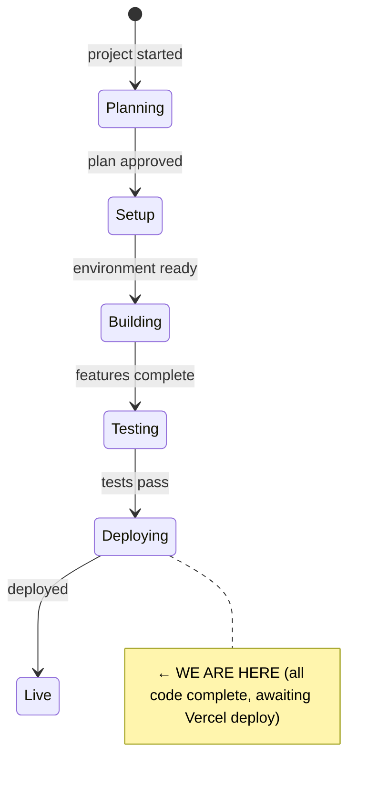
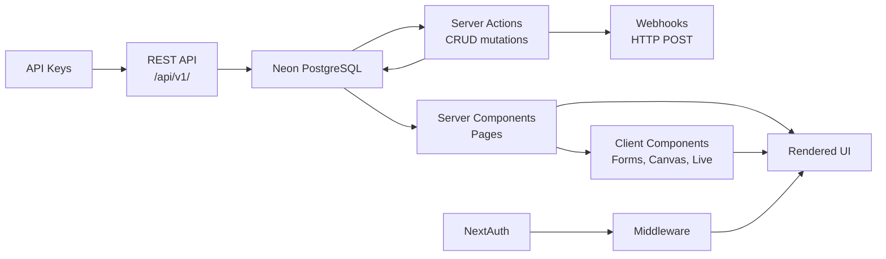

# State

> Last updated: 2026-03-03

## System State Diagram

## Summary

All 5 phases of application code are **feature-complete**. Proposals now flow through live meetings end-to-end (added to agendas, auto-start decision flows, auto-link back to decisions). WCAG 2.1 AA accessibility pass is **complete**. The remaining code work is integration tasks (Google Calendar, Microsoft Outlook, Notion import — plan at `docs/plans/2026-02-27-accessibility-and-integrations.md`, Tasks 11–17). External service configuration (Vercel deploy, Resend email, Sentry, Stripe production setup) still pending. See PLAN.md [Manual Deployment Steps](#manual-deployment-steps) for step-by-step instructions.

**Database:** 26 tables (24 original + `api_keys` + `webhooks`). All columns applied to Neon. Drizzle schema.ts is source of truth; generated migrations may lag behind.

## Component Status

### Phase 0 — Project Setup & Foundation

| Component | Status | Notes |
|-----------|--------|-------|
| Next.js 15 + App Router + TypeScript + Tailwind v4 | ✅ Done | Turbopack dev server configured |
| ESLint + project structure | ✅ Done | `src/app`, `src/lib`, `src/components`, `src/db` |
| UI component foundation | ✅ Done | Custom design system, lucide-react, clsx, Fraunces + DM Sans |
| Design system (globals.css) | ✅ Done | Forest palette (oklch), fluid type scale, status colours |
| NextAuth (Auth.js v5) | ✅ Done | Credentials + magic link + Google + Microsoft OAuth. Edge-compatible middleware. All sign-in methods working. |
| Neon PostgreSQL + Drizzle ORM | ✅ Done | Connected, schema pushed, migrations generated |
| Database schema (26 tables) | ✅ Done | Auth + spaces, decisions, meetings, actions, tags, links, documents, proposals, topics, insights, subscriptions, api_keys, webhooks |
| Sign-in / sign-up pages | ✅ Done | Styled in Glade design system, all auth methods |
| Route protection (middleware) | ✅ Done | Public: `/`, `/sign-in`, `/sign-up`, `/api/v1`, `/shared`, `/public`, `/embed`. All app routes require auth. |
| Update CLAUDE.md | ✅ Done | Full project conventions documented |
| Vercel deployment | ⏳ Pending | See PLAN.md Manual Deployment Steps |
| Resend email | ⏳ Pending | Provider configured in NextAuth, needs `AUTH_RESEND_KEY` |

### Phase 1 — Core Decision Log (MVP)

| Component | Status | Notes |
|-----------|--------|-------|
| Space management (create, switch, cookie) | ✅ Done | Server actions, new-space page, space switcher in sidebar |
| Seed script | ✅ Done | Full demo: 9 users, 7 decisions, 9 actions, 4 meetings, 9 tags, 3 documents, 4 proposals, 4 topics, 3 AI insights. Idempotent with `--force` flag. |
| Replace mock data with DB queries | ✅ Done | All app pages wired to Drizzle queries via `src/lib/queries.ts` |
| Decision CRUD (create, edit) | ✅ Done | `/decisions/new`, `/decisions/[number]/edit`, server actions |
| Meeting CRUD (create, edit) | ✅ Done | `/meetings/new`, `/meetings/[id]/edit`, server actions |
| Action status toggle | ✅ Done | Click-to-cycle status on actions page |
| Decision search + advanced filters | ✅ Done | Search, status, method, tags, participant, date range filters |
| Meeting detail page | ✅ Done | `/meetings/[id]` with notes, agenda, attendees, linked decisions |
| Decision linking UI | ✅ Done | Add/remove links (supersedes, relates_to, amends) from detail page |
| Decision status advance | ✅ Done | "Mark as [next]" button on detail page |
| Link decisions to meetings | ✅ Done | Link/unlink meetings from decision detail page |
| Dashboard | ✅ Done | Stats strip, governance health indicators, recent decisions, open actions, reviews, meetings, AI insights |
| Space settings page | ✅ Done | Name/description, AI toggle, public visibility, vote threshold, walkthrough restart, clear data, danger zone delete |
| Member management + invite | ✅ Done | `/members` with roles, invite by email, remove |
| Responsive layout | ✅ Done | Mobile hamburger nav, responsive padding, single-column on mobile |
| Breadcrumb navigation | ✅ Done | All detail/sub-pages have breadcrumb trails |

### Phase 2 — Governance Documents & Proposals

| Component | Status | Notes |
|-----------|--------|-------|
| Tiptap editor component | ✅ Done | Reusable with toolbar, read-only mode, `immediatelyRender: false` for SSR |
| Document CRUD + versioning | ✅ Done | List, create, edit, detail, publish/unpublish, version history, diffs, historical view |
| Decision trail on sections | ✅ Done | Heading → decision mapping with popover + manager |
| Proposal CRUD + lifecycle | ✅ Done | List, create, edit, detail, status lifecycle, threaded discussion, references |
| Topic CRUD | ✅ Done | List, create, detail, promote to proposal, pull into agendas |
| Auto-save drafts | ✅ Done | Debounced 1.5s auto-save with status indicator |

### Phase 3 — AI Layer

| Component | Status | Notes |
|-----------|--------|-------|
| Anthropic SDK integration | ✅ Done | `@anthropic-ai/sdk`, singleton client, 8 prompt templates |
| Pattern analysis | ✅ Done | Manual trigger on dashboard, generates insights |
| Decision review prompter | ✅ Done | Context-aware reflection questions on review |
| Document intelligence | ✅ Done | Impact analysis, stale doc checker, draft updates |
| Insights panel | ✅ Done | Dismissable insights on dashboard with decision links |
| Monthly digest + member briefing | ✅ Done | On-screen preview (email delivery deferred until Resend) |

### Phase 4 — Meeting Mode

| Component | Status | Notes |
|-----------|--------|-------|
| Meeting setup + agenda builder | ✅ Done | From proposals/topics, time estimates, decision methods |
| Real-time polling | ✅ Done | HTTP 2s polling, version-based optimistic locking |
| Facilitator view | ✅ Done | Agenda sidebar, timer, decision controls, action recording |
| Participant view | ✅ Done | Speaker stack, hand-raise, reactions, votes, objections |
| Decision flows | ✅ Done | Consent (6-stage), vote, advice process, lazy consensus, delegation |
| Configurable vote threshold | ✅ Done | Space setting, threaded to VoteFlow component |
| Share/observer | ✅ Done | Token-based public URLs, QR code, read-only observer |
| Post-meeting | ✅ Done | Structured summary, AI summary, PDF export via print page |

### Phase 5 — SaaS Infrastructure

| Component | Status | Notes |
|-----------|--------|-------|
| Stripe billing | ✅ Done | Schema, checkout, webhooks, portal, feature gates, plan display |
| Transparency layer | ✅ Done | Public pages, public-by-default when toggle on, per-item hide, embeddable widget |
| Onboarding | ✅ Done | Guided flow, interactive walkthrough (7 steps), help docs |
| REST API (`/api/v1/`) | ✅ Done | 6 endpoints: decisions, decisions/[number], documents, documents/[id], meetings, actions |
| API key auth | ✅ Done | SHA-256 hashed keys, `glade_` prefix, settings UI, usage tracking |
| Webhooks | ✅ Done | decision.created/updated/status_changed events, HMAC-SHA256 signing, settings UI |
| Export | ✅ Done | CSV decisions, Markdown docs, Word (.doc) docs, PDF meeting minutes |
| Import | ✅ Done | Markdown → Tiptap JSON on document create |
| SEO + OG images | ✅ Done | Per-page metadata, OG/Twitter cards, JSON-LD, robots, sitemap |
| LLM-readable docs | ✅ Done | `llms.txt` + `llms-full.txt` |
| WCAG 2.1 AA accessibility | ✅ Done | Skip link, landmarks, form errors, icon labels, keyboard nav, live announcements, contrast, canvas a11y, reduced motion, eslint-plugin-jsx-a11y |
| Charity pricing | ⏳ Pending | Needs Stripe coupon/price creation |
| Calendar integration | ⏳ Pending | Plan ready (Tasks 11–14), needs OAuth scope extension |
| Notion import | ⏳ Pending | Plan ready (Tasks 15–16), needs `@notionhq/client` |
| File storage | ⏳ Pending | Needs Vercel Blob or S3 setup |
| Error monitoring | ⏳ Pending | Needs Sentry DSN |
| Performance analytics | ⏳ Pending | Needs Vercel deployment |

## Data Flow

## Dependencies

| Dependency | Status | Notes |
|------------|--------|-------|
| NextAuth (Auth.js v5) | ✅ Working | JWT sessions, Drizzle adapter, credentials + OAuth |
| Neon (PostgreSQL) | ✅ Connected | Schema pushed (26 tables), pooler endpoint |
| Drizzle ORM | ✅ Installed | Schema, relations, migrations configured |
| Anthropic SDK | ✅ Installed | `@anthropic-ai/sdk`, needs `ANTHROPIC_API_KEY` in env |
| diff | ✅ Installed | Text diffing for document version comparison |
| Stripe | ✅ Working | Schema, checkout, webhooks, portal, feature gates |
| Vercel (hosting) | ⏳ Not deployed | See PLAN.md deployment steps |
| Resend (email) | ⏳ Partial | Provider configured, needs `AUTH_RESEND_KEY` |

## Build Status

- `npm run build` — **passing** (as of 2026-03-03)
- `npm run lint` — **no errors** (warnings only from jsx-a11y rules)

## Security & Integrity Hardening (2026-06-10)

Full-app review (`docs/plans/2026-06-10-full-app-review.md`) → Tranche 1 implemented on branch `security-integrity-hardening` (see `docs/plans/2026-06-10-security-integrity-plan.md`). Closes S1–S8, D2, B3, S7:

- `requireSpaceRole(minRole)` helper in `src/lib/space.ts`; all mutating content actions now require member+ (billing/admin actions require admin). Observers are read-only.
- Live-meeting state route scoped to space membership; `initializeMeetingState` derives identity server-side; facilitator-only live actions gated on `meetings.facilitatorId`.
- Unscoped delete/link actions now verify the target belongs to the caller's space.
- Unique index `decisions_space_number_unq` on `(space_id, number)` + `insertDecisionWithUniqueNumber` retry helper (all 4 decision-creation paths).
- Security headers in `next.config.ts` (framing denied app-wide, allowed only on `/embed/*`); webhook SSRF validation; Upstash rate limiting on `/api/v1/*` and live polling; API-key `read_write` value fixed; CSV/HTML export injection neutralised.

## Broken-Features Tranche (2026-06-30)

Tranche 2 implemented on `tranche-2-broken-features` (stacked on Tranche 1). See `docs/plans/2026-06-30-broken-features-plan.md`. Closes B1, B2, B4, B5, B6, B8, B10, D4:

- **B1/B10:** participants can now vote / react / object in live consent & vote flows (input in the flow components, threaded `currentUserId`); responses dedupe per participant+stage.
- **B4:** live state writes go through optimistic locking with retry (`applyStateChange`) — concurrent votes/speaker entries no longer lost.
- **B2:** public observer polls a token-scoped endpoint `/api/shared/meeting/[token]/state` (the id-route stays membership-scoped).
- **B5:** tag CRUD in Settings (`TagManager`), colour chips, decision form shows the tag section always; unique `tags(space_id, name)`.
- **B6:** `overdue` action status derived at read time (`deriveActionStatus`).
- **B8:** meeting summaries use a distinct `meeting_summary` insight type so member-briefing regeneration no longer wipes them.
- **D4:** document autosave writes a `draftContent` buffer; publish-on-Save snapshots a version, clears the draft, and has an `updatedAt` conflict check. New columns `documents.draftContent/draftUpdatedAt`.

Schema migrations applied to Neon: `insight_type += meeting_summary`, `tags_space_name_unq`, `documents.draft_content/draft_updated_at` (plus Tranche 1's `decisions_space_number_unq`).

## Meeting-Flow Overhaul (2026-06-15)

Branch `tranche-3a-meeting-flow` (stacked on Tranche 2). Plan: `~/.claude/plans/steady-frolicking-eagle.md`. Three phases, all build/lint clean:

- **P1:** participants can change AND withdraw reactions/objections/votes/advice/temperature pulses (new `withdrawResponse`); speaker-stack management (status waiting/speaking/spoke, facilitator Call/Done/note via new `SpeakerStack` + `callSpeaker`/`markSpeakerDone`/`setSpeakerNote`); observer view enriched (timer, speaker stack, stage, aggregate tallies, objection count, outcomes).
- **P2:** in-app notifications — new `notifications` table + `notification_type` enum, `NotificationBell` in sidebar, `GET /api/notifications`, `notifyMeetingStarted` trigger on meeting start.
- **P3:** structured objection resolution (resolution + note; consent blocked while an objection stands); `decisions.deliberation` jsonb snapshot rendered on the decision detail page; participant clarifying-question input in consent's Clarify stage.

New Neon migrations: `notifications` + `notification_type`; `decisions.deliberation`. DB now 27 tables.

## Traceability Release (2026-06-15)

Branch `tranche-3b-traceability` (stacked on 3a). Four phases, all build/lint clean, commit per phase:

- **P1 — Provenance panel:** reverse-lookup indexes + queries (`getProposalByDecision`, `getTopicByProposal`, `getDocumentsByDecision`, `getInsightsByDecision`); panel on the decision detail page (origin topic→proposal→decision, decided-at meeting, documents changed, related insights); fixed the dead meeting link; superseded-by badge.
- **P2 — decision_responses:** normalized per-response audit table populated at `recordMeetingDecision` (kept the `deliberation` jsonb snapshot as read-model); `getDecisionResponses`.
- **P3 — proposal↔meeting unification:** `meeting_agenda_items` is now the single source of truth; reads derive from it; "link to meeting" creates an agenda item; backfilled + **dropped `meeting_proposals`**; agenda FK `onDelete: set null`.
- **P4 — review workflow:** `decisions.learnings` + `retiredAt`; `decision_reviews` history table + `review_outcome` enum; overdue-review dashboard queue (`getReviewsDue`); `recordDecisionReview` (keep/amend/supersede/retire, auto-links, learnings); RecordReview UI + history + Retired badge.

New Neon migrations: provenance indexes; `decision_responses`; proposal↔meeting unification (drop `meeting_proposals`, agenda FK set-null); `decisions.learnings`/`retired_at` + `decision_reviews` + `review_outcome` enum. DB now ~28 tables (added `notifications`, `decision_responses`, `decision_reviews`; removed `meeting_proposals`).

Deferred: review-due notifications (no scheduler); `document_versions.decisionId` capture (UI flow); deliberation render on the meeting summary page.

## Performance & Integrity (2026-06-15)

Branch `tranche-4a-performance` (stacked on 3b). Four phases, all build/lint clean, commit per phase:

- **P1:** dashboard stats via SQL `count()/FILTER` aggregates (no more fetch-all-and-filter-in-JS); `requireUser`/`getCurrentSpace`/`getCurrentMembership` wrapped in React `cache()` (space.ts is now a plain server module; client-invoked `createSpace`/`switchSpace` moved to `space-actions.ts`); remaining indexes (actions FKs, subscriptions.stripeSubscriptionId, agenda-item FKs, unique decision_links).
- **P2:** DB driver swapped to **neon-serverless Pool** (`ws` dep) for interactive transactions; the 10 multi-write sequences (recordMeetingDecision, createDecision, createMeeting/updateMeeting, signUp, deleteDecision, clearSpaceData, etc.) wrapped in `db.transaction()`. `insertDecisionWithUniqueNumber` uses savepoints for its retry inside a tx.
- **P3:** v1 API pagination caps (actions/meetings/documents); shared `<Pagination>` on server-rendered lists; decisions log = cap + "Load more" (`loadMoreDecisions`) keeping client filters.
- **P4:** webhooks dispatch via `after()`; live + observer polling stop on completed + skip while tab hidden.

New dependency: `ws`. New Neon migration: P1 indexes. DB driver is now neon-serverless (app runtime); migration/seed `.cjs` scripts still use neon-http.

## Engagement (2026-06-15)

Branch `tranche-4e-engagement` (stacked on 4a). Four phases, build/lint clean, commit per phase:

- **P1:** pending-invite management — `resendInvitation`/`revokeInvitation` (admin) + a "Pending invitations" section on the members page.
- **P2:** user account page — `/account` (edit name via `updateProfile`, read-only email, reused change-password form); sidebar/mobile "Account" link; settings links to it.
- **P3:** review-due notifications — `review_due` notification type (migrated); `notifyReviewsDue` fired lazily from the dashboard via `after()` (deduped one summary per member per week) + best-effort email digest (`sendReviewDigestEmail`).
- **P4:** global ⌘K command palette — `searchSpace` cross-entity server search + `globalSearch` action + `CommandPalette` (mounted in AppShell) + sidebar Search trigger.

New Neon migration: `notification_type += review_due`. No new dependencies.

## Known Issues

- **Deployment:** app is **live** (per owner) — set `UPSTASH_REDIS_REST_URL` / `UPSTASH_REDIS_REST_TOKEN` in Vercel for rate limiting (fails open without them). Earlier "deploy pending" notes in PLAN/CLAUDE are stale.
- **Drizzle migration drift** — schema.ts is ahead of generated migrations (now includes `decisions_space_number_unq`, applied via direct SQL). Run `db:generate` to reconcile.
- **Untracked files** — Several `glade-*.png` screenshots and `.playwright-mcp/` logs in working dir. Safe to gitignore or delete.

<!--
Keep this file as the single source of truth for "where are we?"
The /status command reads this file.
-->
