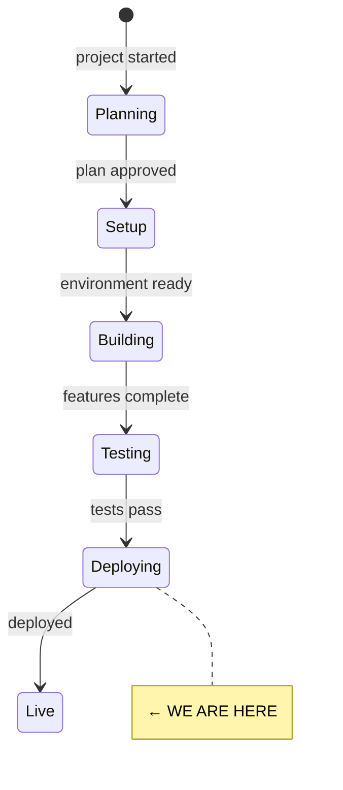
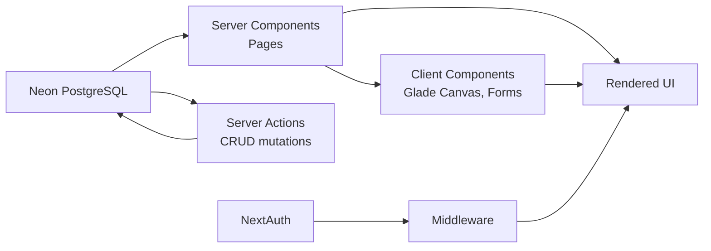

# State

> Last updated: 2026-02-20

## System State Diagram

## Component Status

### Phase 0 — Project Setup & Foundation

| Component | Status | Notes |
|-----------|--------|-------|
| Next.js 15 + App Router + TypeScript + Tailwind v4 | ✅ Done | Turbopack dev server configured |
| ESLint + project structure | ✅ Done | `src/app`, `src/lib`, `src/components`, `src/db` |
| UI component foundation | ✅ Done | Custom design system, lucide-react, clsx, Fraunces + DM Sans |
| Design system (globals.css) | ✅ Done | Forest palette (oklch), fluid type scale, status colours |
| NextAuth (Auth.js v5) | ✅ Done | Credentials + magic link + Google + Microsoft OAuth. Edge-compatible middleware. |
| Neon PostgreSQL + Drizzle ORM | ✅ Done | Connected, schema pushed, migrations generated |
| Database schema (24 tables) | ✅ Done | Auth tables + spaces, decisions, meetings, actions, tags, links, documents, proposals, topics, insights |
| Sign-in / sign-up pages | ✅ Done | Styled in Glade design system, all auth methods |
| Route protection (middleware) | ✅ Done | Public: `/`, `/sign-in`, `/sign-up`. All app routes require auth. |
| Update CLAUDE.md | ✅ Done | Full project conventions documented |
| Vercel deployment | ⏳ Not started | |
| Resend email | ⚠️ Partial | Provider configured in NextAuth, needs API key |

### UI Prototype (built with mock data)

| Component | Status | Notes |
|-----------|--------|-------|
| Landing page (`/`) | ✅ Done | Hero, features, decision lifecycle, methods, CTA, footer |
| App shell + sidebar | ✅ Done | Collapsible sidebar, space selector (hardcoded), nav with active states |
| Dashboard (`/dashboard`) | ✅ Done | Stats strip, governance health indicators, recent decisions, open actions, reviews, meetings |
| Decision log (`/decisions`) | ✅ Done | Timeline view grouped by month, search bar, status filters |
| Decision detail (`/decisions/[number]`) | ✅ Done | Full detail: context, rationale, outcome, actions, lifecycle, linked decisions |
| Actions page (`/actions`) | ✅ Done | Sorted by urgency, status badges, linked decisions |
| Meetings page (`/meetings`) | ✅ Done | Date blocks, attendee/decision counts, type badges |
| The Glade (`/glade`) | ✅ Done | SVG canvas: decisions as tree forms, clustered, sized, growth rings, tooltips |
| Mock data | ✅ Done | 7 decisions, 5 actions, 4 meetings (Riverside Trust) |

### Phase 1 — Core Decision Log (MVP)

| Component | Status | Notes |
|-----------|--------|-------|
| Space management (create, switch, cookie) | ✅ Done | Server actions, new-space page, space switcher in sidebar |
| Seed script | ✅ Done | Full demo: 9 users, 7 decisions, 9 actions (3 complete), 4 meetings (12 agenda items, 2 with notes), 9 tags, 3 documents (4 versions), 4 proposals (8 comments, 2 refs), 4 topics, 3 AI insights. Idempotent with `--force` flag. |
| Replace mock data with DB queries | ✅ Done | All 6 app pages wired to Drizzle queries via `src/lib/queries.ts` |
| Decision CRUD (create, edit) | ✅ Done | `/decisions/new`, `/decisions/[number]/edit`, server actions |
| Meeting CRUD (create) | ✅ Done | `/meetings/new`, server actions |
| Action status toggle | ✅ Done | Click-to-cycle status on actions page |
| Decision search + advanced filters | ✅ Done | Search, status, method, tags, participant, date range filters |
| Mock data removed | ✅ Done | `mock-data.ts` deleted, all pages use DB |
| Meeting detail page | ✅ Done | `/meetings/[id]` with notes, agenda, attendees, linked decisions |
| Decision linking UI | ✅ Done | Add/remove links (supersedes, relates_to, amends) from detail page |
| Decision status advance | ✅ Done | "Mark as [next]" button on detail page |
| Link decisions to meetings | ✅ Done | Link/unlink meetings from decision detail page |
| Dashboard time-aware greeting | ✅ Done | Morning/afternoon/evening based on server time |
| Space settings page | ✅ Done | `/settings` with name/description edit, "Clear all data" (type CLEAR), danger zone delete |
| Member management + invite | ✅ Done | `/members` with roles, invite by email, remove |
| Meeting agenda items | ✅ Done | Ordered agenda with type (for_decision/discussion/information) |
| Loading skeleton | ✅ Done | Generic skeleton loading component |
| Responsive layout | ✅ Done | Mobile hamburger nav, responsive padding, single-column on mobile |
| Breadcrumb navigation | ✅ Done | All detail/sub-pages have breadcrumb trails replacing ArrowLeft back links |

### Phase 2 — Governance Documents & Proposals

| Component | Status | Notes |
|-----------|--------|-------|
| Document schema (3 tables) | ✅ Done | `documents`, `document_versions`, `document_section_links` + enums |
| Proposal schema (2 tables) | ✅ Done | `proposals`, `proposal_comments` + enum |
| Topic schema (1 table) | ✅ Done | `topics` + enum |
| Tiptap editor component | ✅ Done | Reusable with toolbar, read-only mode, Glade-styled |
| Document CRUD | ✅ Done | List (grouped by type), create, edit, detail, publish/unpublish |
| Document version history | ✅ Done | Timeline view with version descriptions, linked decisions |
| Proposal CRUD | ✅ Done | List (grouped by status), create, edit, detail |
| Proposal status lifecycle | ✅ Done | draft → open_for_discussion → ready_for_decision → decided → implemented |
| Proposal threaded discussion | ✅ Done | Comments with replies, inline reply form |
| Topic CRUD | ✅ Done | List with type icons, create with radio selector, detail |
| Promote topic to proposal | ✅ Done | Creates proposal, links back to topic |
| Sidebar nav enabled | ✅ Done | Documents, Proposals, Topics all active |
| Auto-save drafts | ✅ Done | Debounced 1.5s auto-save with status indicator |
| Document diffs | ✅ Done | Visual diff between any two versions |
| Historical document view | ✅ Done | Date picker to view document as it was |
| Decision trail on sections | ✅ Done | Heading → decision mapping with popover + manager |
| Pull topics into agendas | ✅ Done | "Add from topics" dropdown in meeting form |
| Proposal references | ✅ Done | URL+title references on proposals |
| Proposal → decision flow | ✅ Done | Create decision from decided proposal |

## Data Flow

### Phase 3 — AI Layer

| Component | Status | Notes |
|-----------|--------|-------|
| Anthropic SDK integration | ✅ Done | `@anthropic-ai/sdk`, singleton client in `src/lib/ai.ts` |
| AI prompts system | ✅ Done | `src/lib/ai-prompts.ts` — 8 prompt templates |
| Per-space AI toggle | ✅ Done | Settings page toggle, `spaces.settings` JSONB |
| Insights table | ✅ Done | `insights` table with type/status enums, relations to spaces/decisions/documents |
| Pattern analysis | ✅ Done | Manual "Analyse patterns" button on dashboard, generates insights |
| Insights panel | ✅ Done | Dashboard right column, dismissable insights with decision links |
| Decision review prompter | ✅ Done | Generate review questions on decision detail (when review date set) |
| Document intelligence | ✅ Done | "Check document impact" on decision detail, suggests documents to update |
| Stale document checker | ✅ Done | Space-wide check on documents page, flags docs needing review |
| Draft document updates | ✅ Done | AI-drafted text changes from decision on document edit page |
| Member briefing | ✅ Done | On-demand governance briefing on dashboard |
| Governance digest | ✅ Done | Monthly digest preview on dashboard (email delivery deferred) |

### Phase 4 — Meeting Mode

| Component | Status | Notes |
|-----------|--------|-------|
| Meeting status lifecycle | ✅ Done | `meeting_status` enum: draft, scheduled, in_progress, completed |
| Agenda item enhancements | ✅ Done | `agenda_item_status` enum, `durationMinutes`, `proposalId`, `topicId` columns |
| Meeting form (enhanced) | ✅ Done | Status select, time estimates per item, proposal linking |
| Meeting edit page | ✅ Done | `/meetings/[id]/edit` route wired to form |
| Meeting detail (enhanced) | ✅ Done | Status badge, edit link, duration display on agenda items |
| Schema: shareToken + sessionState | ✅ Done | Added to meetings table, migration applied |
| Shareable agenda link | ✅ Done | Generate/revoke share tokens, public `/shared/meeting/[token]` page |
| Polling infrastructure | ✅ Done | HTTP polling via `/api/meetings/[id]/state`, version-based optimistic locking |
| Meeting state types | ✅ Done | `MeetingSessionState` with timer, speakers, decision flow, participants |
| Facilitator view | ✅ Done | 2-column layout: agenda sidebar + current item panel with timer, controls |
| Participant view | ✅ Done | Read-only with speaker stack, hand-raise, decision flow interactions |
| Consent decision flow | ✅ Done | 6-stage: present → clarify → react → object → integrate → decide |
| Vote decision flow | ✅ Done | 3-stage: present → vote → results with live tally |
| Advice/lazy consensus flows | ✅ Done | Simplified 2-stage: present → record |
| Public observer view | ✅ Done | `/shared/meeting/[token]/live` read-only observer |
| Meeting summary page | ✅ Done | Structured summary with decisions, outcomes, attendance stats |
| AI meeting summary | ✅ Done | AI-generated summary with generate button |
| End meeting flow | ✅ Done | Freezes state, sets status completed, redirects to summary |

### Phase 5 — SaaS Infrastructure (partial)

| Component | Status | Notes |
|-----------|--------|-------|
| Stripe billing integration | ✅ Done | Schema, checkout session, webhook handler, customer portal |
| Plan definitions + pricing | ✅ Done | Free (Seedling) + paid (Canopy) tiers |
| Feature gate enforcement | ✅ Done | Server-side checks + client-side upgrade prompts |
| Billing management UI | ✅ Done | Settings page with plan display, Stripe portal link |
| SEO metadata + OG images | ✅ Done | Per-page titles, OG/Twitter cards, JSON-LD, robots, sitemap |
| LLM-readable docs | ✅ Done | `llms.txt` + `llms-full.txt` |

Next milestone: Vercel deployment, Resend email, remaining Phase 5 items.

## Dependencies

| Dependency | Status | Notes |
|------------|--------|-------|
| NextAuth (Auth.js v5) | ✅ Working | JWT sessions, Drizzle adapter, credentials + OAuth |
| Neon (PostgreSQL) | ✅ Connected | Schema pushed (24 tables), pooler endpoint |
| Drizzle ORM | ✅ Installed | Schema, relations, migrations configured |
| Anthropic SDK | ✅ Installed | `@anthropic-ai/sdk`, needs `ANTHROPIC_API_KEY` in env |
| diff | ✅ Installed | Text diffing for document version comparison |
| Vercel (hosting) | Not set up | |
| Resend (email) | Partial | Provider configured, needs `AUTH_RESEND_KEY` |
| Stripe (billing) | ✅ Working | Schema, checkout, webhooks, portal, feature gates |

<!--
Keep this file as the single source of truth for "where are we?"
The /status command reads this file.
-->
